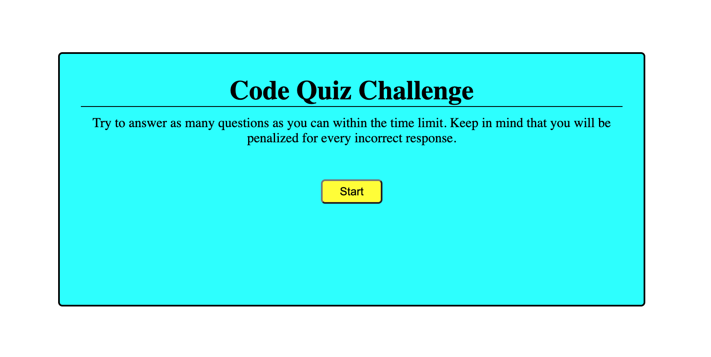
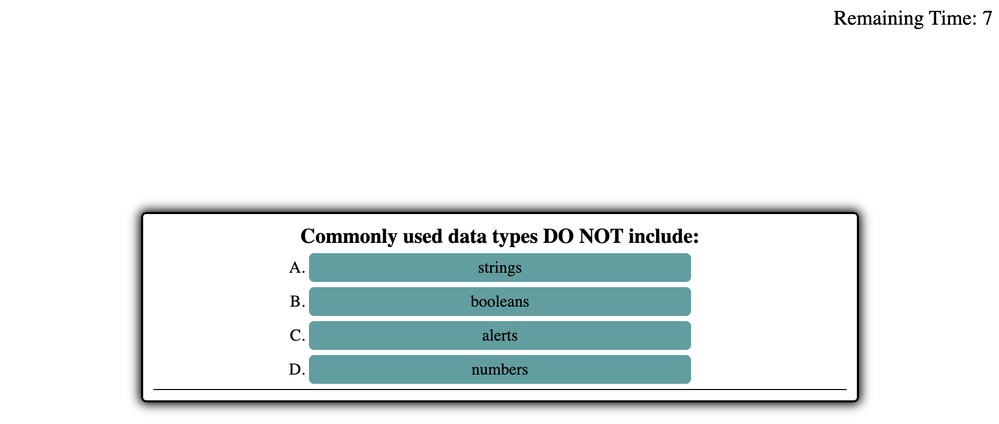

# Code-Quiz

## Description

This project is a quiz challenge game. The objective for this project is to engage the user with a series of code related questions. The user must answer as many questions as they can in the given time frame. Upon completion the user has the option to save their score for later records.

## Developer intentions

The intention behind this project as the developer was to become aquainted with web APIs. To demonstrate understanding of combining HTML, CSS, and Javascript to create dynamic and interactive elements. Further enhance my understanding of using the DOM and incorporating localStorage.

## Usage 

The application was published through github and can be accessed via the provided link below.
This application is still in the working. I will be implementing visual enhancements as well as functional in the near future.

## Links

[Link to Deployed Application](https://armondr.github.io/Code-Quiz/)

[Link to Application Repository](https://github.com/ArmondR/Code-Quiz)

## Screenshots

## Credits

Contributions to the functinality of this application goes to the program TAs: Bobby Hoffman and Jasper Abarquez for troubleshooting support as well as class instructor Kevin Ferguson for question logic set up. Also help recieved from tutor Michell Brito for assistence in expanding my knowledge in dynamic code generation.

### License

______

MIT License

Copyright (c) [2021] [Armond Rodriguez]

Permission is hereby granted, free of charge, to any person obtaining a copy
of this software and associated documentation files (the "Software"), to deal
in the Software without restriction, including without limitation the rights
to use, copy, modify, merge, publish, distribute, sublicense, and/or sell
copies of the Software, and to permit persons to whom the Software is
furnished to do so, subject to the following conditions:

The above copyright notice and this permission notice shall be included in all
copies or substantial portions of the Software.

THE SOFTWARE IS PROVIDED "AS IS", WITHOUT WARRANTY OF ANY KIND, EXPRESS OR
IMPLIED, INCLUDING BUT NOT LIMITED TO THE WARRANTIES OF MERCHANTABILITY,
FITNESS FOR A PARTICULAR PURPOSE AND NONINFRINGEMENT. IN NO EVENT SHALL THE
AUTHORS OR COPYRIGHT HOLDERS BE LIABLE FOR ANY CLAIM, DAMAGES OR OTHER
LIABILITY, WHETHER IN AN ACTION OF CONTRACT, TORT OR OTHERWISE, ARISING FROM,
OUT OF OR IN CONNECTION WITH THE SOFTWARE OR THE USE OR OTHER DEALINGS IN THE
SOFTWARE.

### Badges

____

